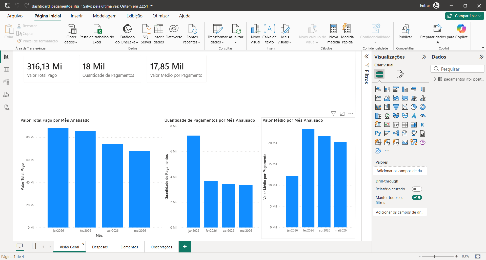
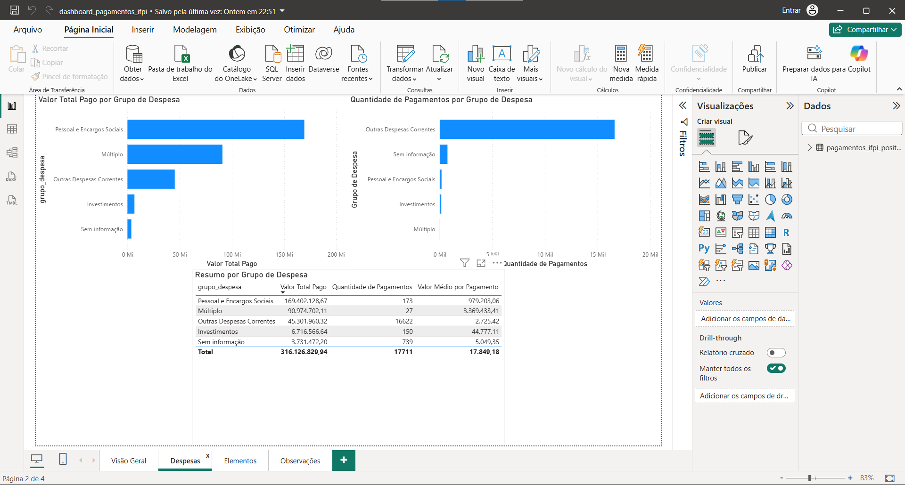
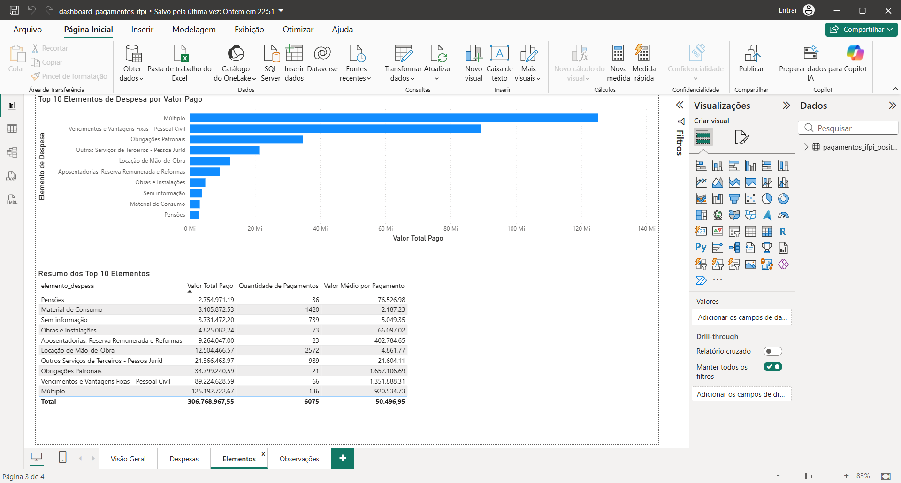
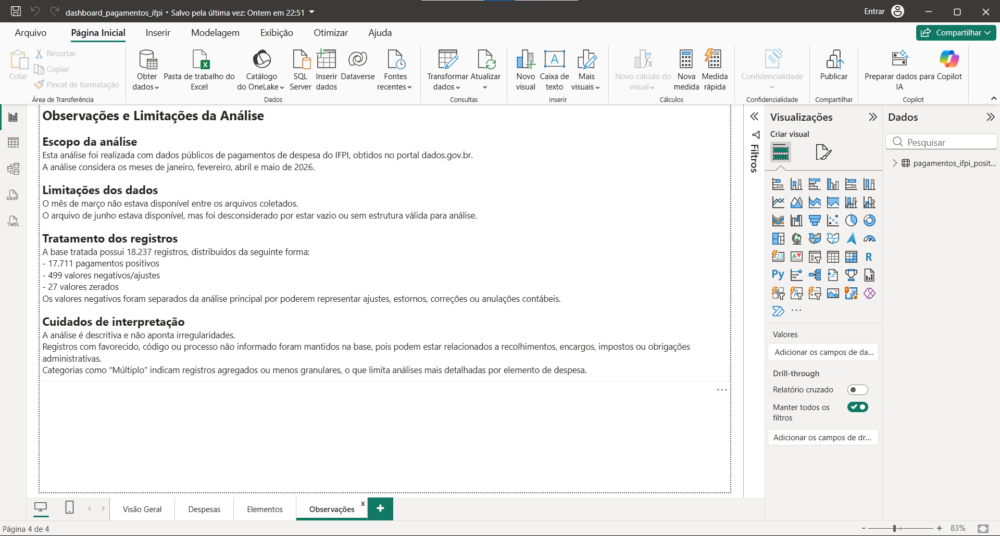

# Análise de Pagamentos Públicos do IFPI

Projeto de análise de dados públicos relacionados a pagamentos de despesa pública do Instituto Federal do Piauí (IFPI).

O objetivo do projeto foi praticar um fluxo completo de análise de dados, passando por coleta, tratamento, validação, preparação da base, criação de medidas e desenvolvimento de um dashboard em Power BI.

## Tecnologias utilizadas

- Python
- Pandas
- Jupyter Notebook
- Power BI
- Power Query
- DAX
- GitHub

## Fonte dos dados

Os dados utilizados foram obtidos no Portal Brasileiro de Dados Abertos, no conjunto relacionado à administração de despesa pública e pagamentos.

Foram considerados arquivos mensais referentes a:

- Janeiro de 2026
- Fevereiro de 2026
- Abril de 2026
- Maio de 2026

O mês de março não estava disponível entre os arquivos coletados. O arquivo de junho estava disponível, porém foi desconsiderado por estar vazio ou sem estrutura válida para análise.

## Objetivo da análise

A análise teve como objetivo responder perguntas como:

- Qual foi o valor total pago no período analisado?
- Qual foi a quantidade de pagamentos realizados?
- Como os valores pagos se distribuíram por mês?
- Quais grupos de despesa concentraram maior valor financeiro?
- Quais grupos tiveram maior quantidade de registros?
- Quais elementos de despesa tiveram maior participação no valor total pago?

## Tratamento dos dados

O tratamento dos dados foi realizado em Python com a biblioteca Pandas.

Principais etapas realizadas:

- Importação dos arquivos CSV mensais
- Criação da coluna de identificação do mês do arquivo
- União das bases com `pd.concat()`
- Verificação de tipos de dados, valores nulos e duplicatas
- Conversão de colunas de data
- Conversão de valores monetários
- Criação de colunas auxiliares de ano, mês e dia
- Tratamento de valores nulos em campos como processo, código do favorecido e favorecido
- Separação entre pagamentos positivos, valores negativos/ajustes e valores zerados
- Criação de bases e resumos para análise e visualização

## Base tratada

A base consolidada possui:

- 18.237 registros totais
- 17.711 pagamentos positivos
- 499 valores negativos/ajustes
- 27 valores zerados

Os valores negativos foram separados da análise principal por poderem representar ajustes, estornos, correções ou anulações contábeis.

## Dashboard em Power BI

O dashboard foi desenvolvido no Power BI e dividido em quatro páginas:

### 1. Visão Geral

Apresenta os principais indicadores e a evolução mensal dos pagamentos.

Indicadores:

- Valor total pago
- Quantidade de pagamentos
- Valor médio por pagamento

### 2. Despesas

Analisa os pagamentos por grupo de despesa, comparando valor total, quantidade de registros e valor médio.

### 3. Elementos

Mostra os principais elementos de despesa por valor pago, destacando os itens com maior concentração financeira.

### 4. Observações

Apresenta limitações da análise, cuidados de interpretação e observações sobre os dados utilizados.

## Principais insights

Alguns insights identificados durante a análise:

- Janeiro apresentou o maior valor total pago entre os meses analisados.
- O grupo **Pessoal e Encargos Sociais** concentrou o maior valor financeiro.
- O grupo **Outras Despesas Correntes** concentrou a maior quantidade de pagamentos.
- O grupo **Múltiplo** apresentou poucos registros, mas valores elevados, indicando registros mais agregados ou menos granulares.
- Entre os elementos de despesa, destacaram-se **Múltiplo**, **Vencimentos e Vantagens Fixas - Pessoal Civil** e **Obrigações Patronais**.
- A análise mostra diferença entre concentração financeira e volume operacional de registros.

## Limitações da análise

- O mês de março não estava disponível entre os arquivos coletados.
- O arquivo de junho foi desconsiderado por estar vazio ou sem estrutura válida.
- A análise é descritiva e não aponta irregularidades.
- Valores negativos foram analisados separadamente por poderem representar ajustes, estornos ou correções.
- Registros com informações ausentes foram mantidos após tratamento, pois podem estar relacionados a recolhimentos, encargos, impostos ou obrigações administrativas.
- Categorias como **Múltiplo** limitam análises mais detalhadas por falta de granularidade.

## Estrutura do repositório

- `analise_pagamentos_ifpi.ipynb`: notebook com o tratamento e preparação dos dados
- `dashboard_pagamentos_ifpi.pbix`: arquivo do dashboard em Power BI
- `dados_tratados/`: arquivos resumidos utilizados para apoio à análise
- `imagens_analise/`: imagens das páginas do dashboard

## Observação sobre os dados

Os arquivos brutos e as bases tratadas completas não foram incluídos no repositório devido ao tamanho dos arquivos e por serem dados públicos disponíveis na fonte original. Foram incluídos arquivos resumidos em `dados_tratados/` para apoiar a reprodução dos principais resultados.

O processo de tratamento, limpeza e preparação dos dados está documentado no notebook do projeto.

## Objetivo do projeto no portfólio

Este projeto foi desenvolvido com foco em portfólio para demonstrar habilidades em:

- Tratamento de dados com Python e Pandas
- Uso de dados públicos reais
- Análise descritiva
- Criação de indicadores
- Construção de dashboard em Power BI
- Documentação de metodologia, insights e limitações
